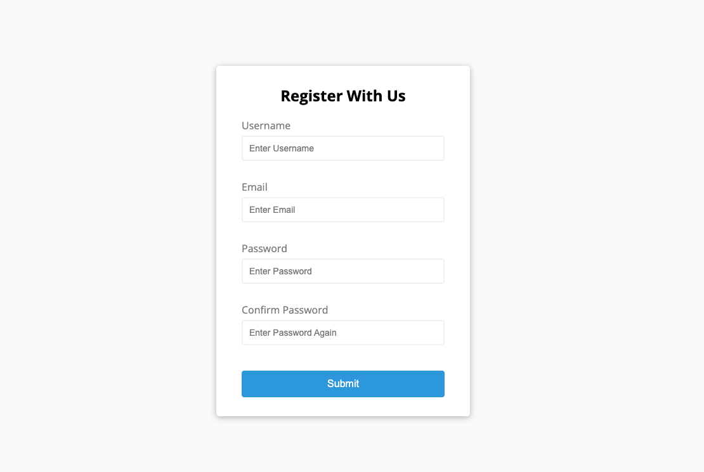

# Before and After Refactor:

Just an example of form validation in vanilla JS refactoring before and after. Some disorganized notes taken after recovering from covid related hospitalization.

## Table of Contents

1. [Form Validator](#form-validator-module)
2. [Movie Seat Selector](#movie-seat-selector-module)
3. [Custom Video Player](#custom-video-player-module)

## Form Validator Module



### New Methods Used:

- `charAt()` used to access first letter of input field and change to uppercase.

### If Statements (not clean nor scalable)

```JS
// will do if statements first. Simple easy way

const form = document.getElementById('form');
const username = document.getElementById('username');
const email = document.getElementById('email');
const password = document.getElementById('password');
const password2 = document.getElementById('password2');


// ----------- Functions --------------

// Show Input Error Message
function showError(input, message) {
    // .parentElement will get the form control div
    const formControl = input.parentElement;
    // change class to error color and display the small text below
    formControl.className = 'form-control error';
    // create variable for small text
    const small = formControl.querySelector('small');
    // display error message from submit event listener as small variable
    small.innerText = message;
}


// Show Success Outline
function showSuccess(input) {
    const formControl = input.parentElement;
    // change form input outline when successful
    formControl.className = 'form-control success'
}

// Check Email Validity
function isValidEmail(email) {
    // With regular expression
    // Just search "js email regex" for validation
    const re = /^(([^<>()[\]\.,;:\s@\"]+(\.[^<>()[\]\.,;:\s@\"]+)*)|(\".+\"))@(([^<>()[\]\.,;:\s@\"]+\.)+[^<>()[\]\.,;:\s@\"]{2,})$/i;
    return re.test(String(email).toLowerCase());
}


// ---------------- Event Listeners ----------------------
form.addEventListener('submit', function(e) {
    e.preventDefault();

    if(username.value === '') {
        showError(username, 'Username is Required')
    } else {
        showSuccess(username)
    }

    if(email.value === '') {
        showError(email, 'Email is Required')
    } else if(!isValidEmail(email.value)) {
        showError(email, 'Email is not Valid')
    } else {

        showSuccess(email)
    }

    if(password.value === '') {
        showError(password, 'Password is Required')
    } else {
        showSuccess(password)
    }

    if(password2.value === '') {
        showError(password2, 'Reenter Password is Required')
    } else {
        showSuccess(password2)
    }


})
```

### Refactored with 'High Order Array' Method.

Instructor has separate video lesson that explains each high order array method (there are reportedly five.) I've used `forEach()` the most personally. The first time was while making my [JavaScript SnakeGame]().

##### New Methods Used:

- `charAt()` used to access first letter of input field and change to uppercase.

```JS
// will do if statements first. Simple easy way

const form = document.getElementById('form');
const username = document.getElementById('username');
const email = document.getElementById('email');
const password = document.getElementById('password');
const password2 = document.getElementById('password2');


// ----------- Functions --------------

// Show Input Error Message
function showError(input, message) {
    // .parentElement will get the form control div
    const formControl = input.parentElement;
    // change class to error color and display the small text below
    formControl.className = 'form-control error';
    // create variable for small text
    const small = formControl.querySelector('small');
    // display error message from submit event listener as small variable
    small.innerText = message;
}


// Show Success Outline
function showSuccess(input) {
    const formControl = input.parentElement;
    // change form input outline when successful
    formControl.className = 'form-control success'
}

// Check Email Validity
function checkEmail(input) {
    // With regular expression
    // Just search "js email regex" for validation
    const re = /^(([^<>()[\]\.,;:\s@\"]+(\.[^<>()[\]\.,;:\s@\"]+)*)|(\".+\"))@(([^<>()[\]\.,;:\s@\"]+\.)+[^<>()[\]\.,;:\s@\"]{2,})$/i;
    if(re.test(input.value.trim())) {
        showSuccess(input)
    } else {
        showError(input, 'Email is not valid.')
    }
}

// Check Required Fields
function checkRequired(inputArr) {
    //have to loop through each item in array. will do by using higher order array method
    inputArr.forEach(function(input) {
        // creating input as index variable for each array item
        if(input.value.trim() === '') {
            // To display what is required access name through html id
            console.log(input.id) // to see
            showError(input, `${getFieldName(input)} is required`)
        } else {
            showSuccess(input)
        }
    });
}

// Check input length
function checkLength(input, min, max) {
    // length can be used on arrays and strings
    if(input.value.length < min) {
        showError(input, `${getFieldName(input)} must be at least ${min} characters.`);
    } else if(input.value.length > max) {
        showError(input, `${getFieldName(input)} must be less than ${max} characters long.`);
    } else {
        showSuccess(input);
    }
}


// Check Passwords Match
function checkPasswordsMatch(input1, input2) {
    if(input1.value !== input2.value) {
        showError(input2, 'Passwords do not match.')
    } else {
        showSuccess(input);
    }
}


// Get Field Name (to capitalize first letter of small text for errorMessage)
function getFieldName(input) {
    // use character at method to change the first letter (zero based indexing duh) to capitalized letter then concatenate the rest of the input minus first letter by accessing the input content by way of id then using the .slice() method and selecting which character (zero based indexing again duh) we'd like to pick up from.
    return input.id.charAt(0).toUpperCase() + input.id.slice(1);
}


// ---------------- Event Listeners ----------------------
form.addEventListener('submit', function(e) {
    e.preventDefault();

    // Higher Order Array Function =>
        // Instead of passing through each field (ie username, password, email, etc) we can pass through an array of objects
    checkRequired([username, email, password, password2]);
    // checkLength(var, min, max)
    checkLength(username, 3, 15);
    checkLength(password, 6, 25);
    checkEmail(email);
    checkPasswordsMatch(password, password2)
})
```

## Movie Seat Selector Module


##### New Methods Used:

`.forEach()` `.Map()`

##### Used Methods

- Saving to Local Storage
- High Order Array Methods
  1. forEach()
  2. Map()
- Spread Operator

### Notes - Movie Seat Selector

You can change a `typeOf` string variable to a number variable by adding a plus sign `+` in front of the variable, this can also be achieved by using the parseInt() function. It's easier than parseInt()

```JS
const ticketPrice = +movieSelect.value;

console.log(typeOf(ticketPrice))
```

## Custom Video Player Module

We're going to use the [JavaScript Video and Audio API](https://developer.mozilla.org/en-US/docs/Learn/JavaScript/Client-side_web_APIs/Video_and_audio_APIs) to build a completely custom video player. Create our own buttons and link the time stamp to the UI display for the user.


### New Methods Used:

Time Stamp (can be used in game timing?)

### Notes - Movie Seat Selector
